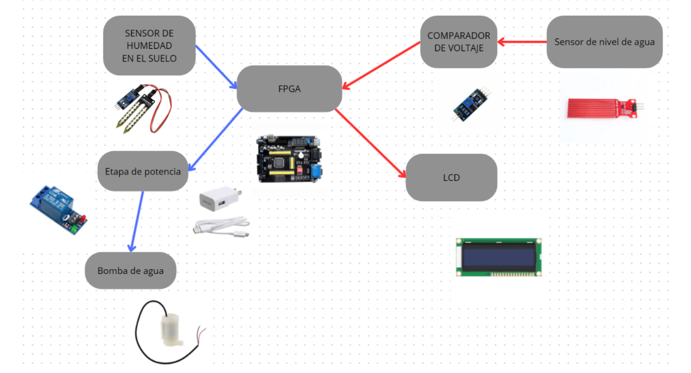
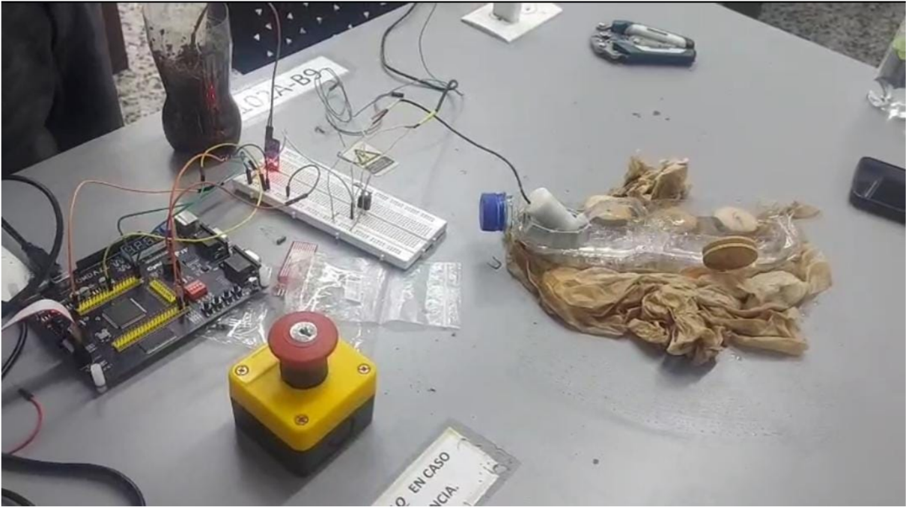
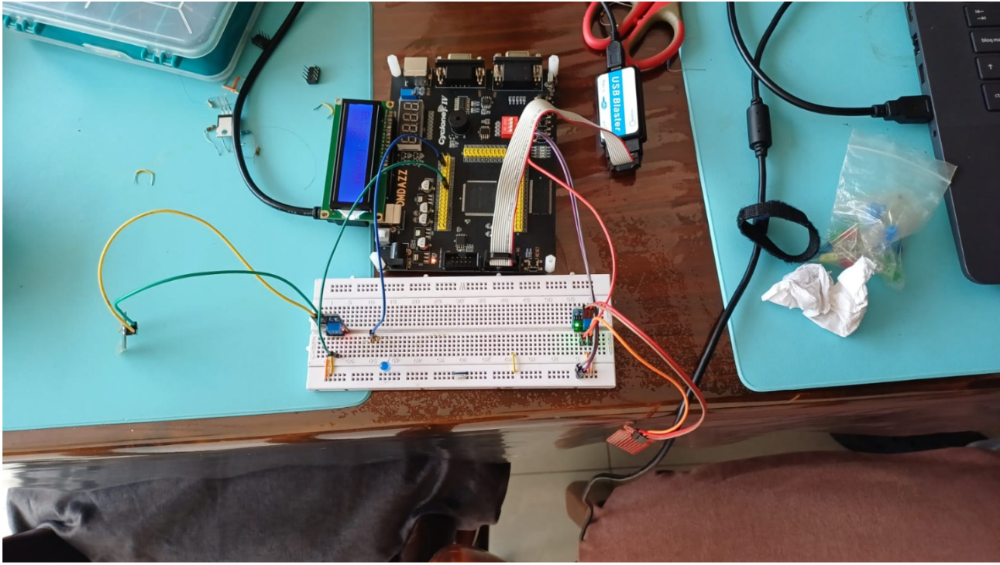
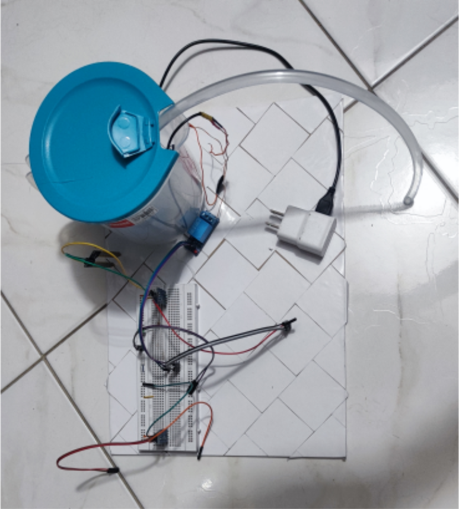
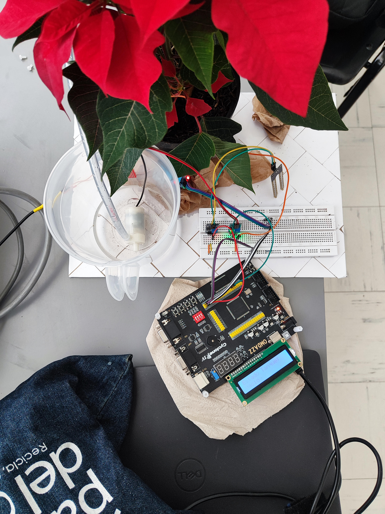

# Proyecto final - Electrónica Digital 1 - 2025-II

# Integrantes
- Santiago Rojas Valero
- Nicolas Cerón Melo
- Juan Esteban Barrera Ortiz

# Nombre del proyecto
Wuyang

# Documentación
Los archivos de verilog se pueden obserbar en:
- [Modulo LCD](LCD.v)
- [Modulo regador](Pruebas1.v)
- [Modulo Top](top.v)

## Descripción de la arquitectura

Los principales sensores y herramientas usados en el proyecto son los siguientes:
- Sensor de nivel de agua HW-038 [1].
- Sensor de humedad FC-28 [2].
- Comparadores de tension LM393 [3].  ́
- Modulo de rele [4].  ́
- FPGA Cyclone IV OMDAZZ.
- Pantalla LCD [5].
- Bomba de agua.
- Fuente/cargador de 5V 1A.

El proyecto, de forma general, se divide en dos partes. La primera se encarga del regado automatico de las plantas, el cual tiene un sensor de humedad, una etapa de potencia hecha con un modulo rele y un cargador, la bomba de agua, y a la FPGA. En este caso la FPGA tiene una funcion de ”temporizador”. Debido a que la tierra tarda tiempo en absorber la humedad, la bomba solo se va a activar cada cierta cantidad de tiempo, si es que el sensor indica que hay falta de humedad. Si se cumple todo para que la planta sea regada, la bomba se activara por 3 segundos, botando una cantidad de agua limitada evitando el riego excesivo. La segunda fase del proyecto se encarga de revisar el estado del tanque de agua. El recurso mas fundamental para el funcionamiento del regador es el agua, con un sensor de nivel se puede detectar cuando hay ausencia de agua en el tanque. La informacion se transmite a la FPGA, de forma que se pueda traducir a algo legible en la LCD. El mensaje en la pantalla es, entonces,”Estado del tanque: vacio/lleno”. Las salidas de ambos sensores son simples senales binarias, de 1 bit. La logica empleada en la primera etapa es secuencial, pues se construy  ́ o a partir  ́
de contadores, y se ve una interaccion entre el estado actual y futuro del sistema. Por otro lado, la segunda etapa es solo combinacional, aunque cabe aclarar que la implementacion de la LCD se hace por medio de una FSM.
## Diagramas de la arquitectura
El diseño de la arquitectura se puede observar en el circuito implementado en la siguiente figura:

 

 Figura 1. Implementación del proyecto Wuyang.

## Simulaciones

## Evidencias de implementación

Al inicio, se realizaron pruebas sencillas de funcionamiento, comprobando el funcionamiento de cada componente de forma individual para su posterior integracion en el proyecto.Primero se comprueba la salida de de los sensores, ya que el sensor de humedad presenta un modulo que facilita una salida digital, verificamos el nivel de voltaje de esta y sus conexiones. Con el fin de observar la fuerza de la bomba con la energ ́ıa suministrada, el correcto funcionamiento de los pines de la FPGA y la capacidad de temporizar, como se ve acontinuación:

 

 Figura 1. Primeras duras pruebas.

El sensor de nivel de agua presenta unicamente una salida analogica, como solución para este obst  ́ aculo se opta por acoplar un modulo igual al que usa el senso de agua debido al conocimiento de su funcionamiento, accesibilidad y precio.Tras esto, se fueron integrando los sensores hasta completar las dos fases del
prototipo. Por un lado, se consiguio el control de la LCD a partir de la salida del sensor de nivel de agua, y por otro lado, se comprobo que con los contadores en accion, la bomba solo se encendiera si el sensor de humedad en el piso daba la se  ́ nal. El montaje preliminar comprobando el funcionamiento de los sensores y demas, en este caso, los sensores solo se sumergían en agua para cambiar su salida.

Al integrar todo en un prototipo final, se observa un montaje similar el visto en la siguiente imagen:

 

 Figura 1. Pruebas con sensor de humendada.

Al integrar todo en un prototipo final, se observa un montaje similar el visto a continuación:

 

 Figura 1. Prototipo montaje inicial.

 

 Figura 1. Prototipo montaje Final.

Adicionalmente se puede ver un [video](Imagenes/Video_final.mp4) en el que se muestra el funcionamiento y se hace una explicación adicional simple del funcionamiento.

La parte mas importante de las pruebas hechas con el proyecto ya montado tienen que ver con el tiempo de regado y el tiempo entre regados. Estos tiempos se acomodan manualmente, pero en realidad cambian para el tipo de planta, su tamano, y demas, en nuestro caso se escogi  ́ o una flor de pascua, la cual es sensible tanto al  ́
exceso como a la falta de humedad; por ejemplo, el riego moderado se debe realizar cada 4 a 7 d ́ıas, se debe tener en cuenta que el agua tambien, es un desafi  ́ o crucial al contar con equipos electronicos por ello nos enfocamos en tener un tanque de agua que tuviera pocos orificios los cuales se pueda filtrar para no tener ningun inconveniente.